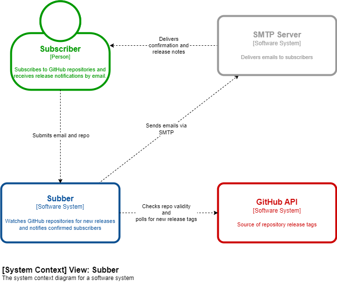
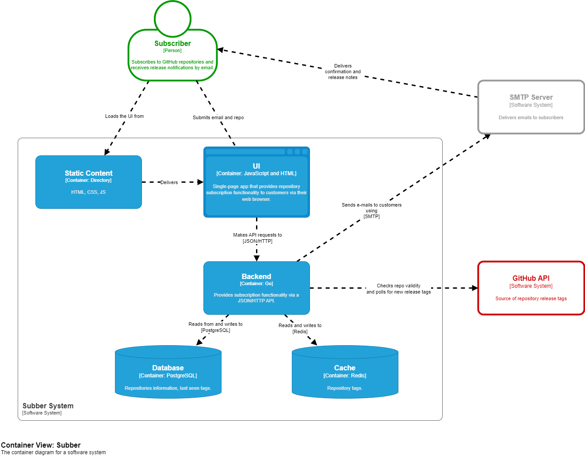
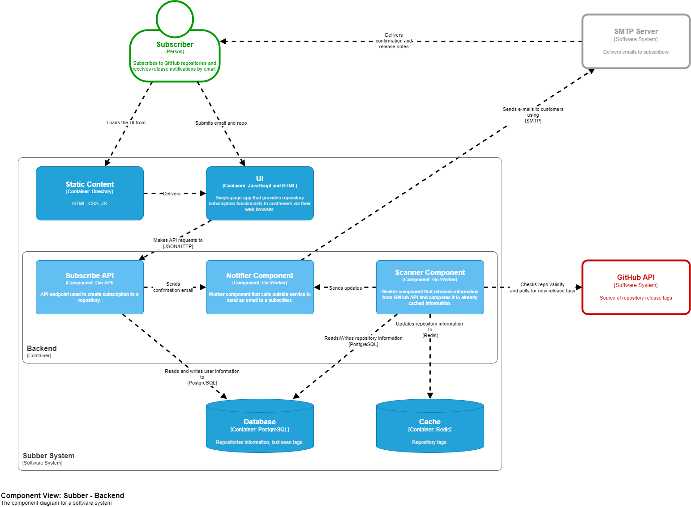
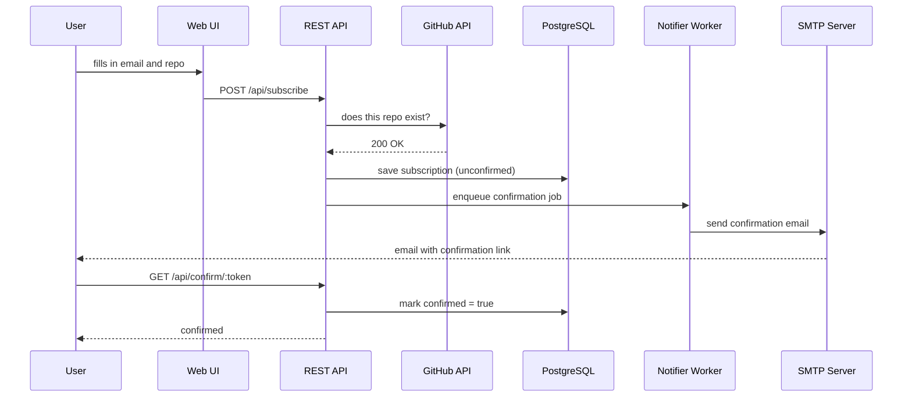
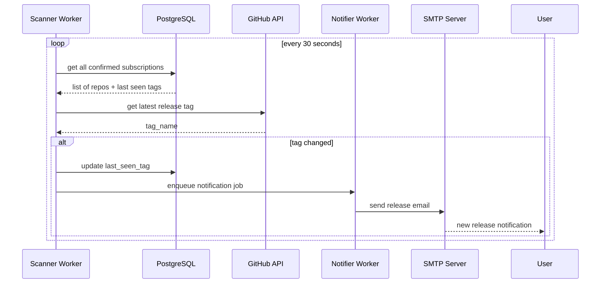

# Software Design Document — Subber

## 1. Introduction

**Purpose**: Define the architecture and design of Subber.

**Scope**: REST API, API key authentication, background worker architecture, PostgreSQL storage, Redis caching, and Docker deployment.

**Architecture**: Single monolith with two concurrent background workers. No microservices.

---

## 2. System Overview

1. A user submits their email and a GitHub repository via the web form
2. Subber saves the subscription as unconfirmed and sends a confirmation email
3. The user clicks the confirmation link — the subscription becomes active
4. A background scanner periodically polls GitHub for new release tags
5. When a new tag is detected, every confirmed subscriber of that repository receives an email

---

## 3. Architecture

### Technology Stack:

| Layer | Technology |
|---|---|
| Language | Go |
| HTTP framework | Gin |
| Database | PostgreSQL |
| Cache | Redis |
| Email | SMTP |
| Containerisation | Docker, Docker Compose |

### System Containers

**Components**:
- **Subber App (Go)** - handles API requests, polling, and email delivery
- **PostgreSQL** - stores all subscription state
- **Redis** - caches GitHub API responses to reduce external calls

### Backend Components

Internally, the Go monolith is divided into:
- **Subscribe API** - handles HTTP requests and DB writes
- **Scanner Worker** - periodically checks GitHub for new release tags
- **Notifier Worker** - consumes jobs from an internal channel and delivers emails via SMTP

**Data flow**:

1. Subscription flow:

2. Release notification flow:

---

## 4. Non-Functional Properties

| Property | Value      | Rationale |
|---|------------|---|
| Scan interval | 30 seconds | Balances notification latency against GitHub API rate limits |
| GitHub API cache TTL | 45 seconds | Reduces repeated calls for repos with no new releases |
| GitHub HTTP client timeout | 10 seconds | Prevents scanner from stalling on slow API responses |
| HTTP server read header timeout | 10 seconds | Mitigates Slowloris-style connection exhaustion |
| Scan cycle timeout | 20 seconds | Bounds the worst-case duration of a single scan pass |

---

## 5. Data Model
**Relations**: Single denormalized table. No separate `users` or `repositories` tables to eliminate `JOIN` overhead.

**Table**: `subscriptions`

| Field | Type | Purpose |
|---|---|---|
| `email` | String | Subscriber's email address (part of PK) |
| `repo` | String | Target repository, e.g., `owner/repo` (part of PK) |
| `confirmed` | Boolean | Guards against unverified addresses receiving notifications |
| `token` | UUID | Used in confirmation and unsubscribe links |
| `last_seen_tag` | String | Baseline for detecting new releases |

**Search Patterns**:
- **User view**: Fetch all subscriptions for a specific `email`.
- **Auth**: Look up a single record by `token` (confirm/unsubscribe).
- **Scanner target list**: Fetch distinct `repo`s where `confirmed = true`.
- **Notifier dispatch**: Fetch all `email`s for a specific `repo` where `confirmed = true`.

**Index Strategy**:
- **Composite Primary Key** (`email`, `repo`): Prevents duplicates and implicitly indexes `email` for the user view.
- **Unique Index** (`token`): Ensures fast O(1) lookups for confirmation links.
- **Partial Index** (`repo`) `WHERE confirmed = true`: Keeps index size minimal while highly optimizing Scanner and Notifier worker queries.

Schema is embedded into the binary and applied on startup.

---

## 6. External Interfaces

**GitHub API** - two call types:

- *Repository existence check* (on subscribe): HEAD request to `/repos/{owner}/{repo}`. 404 → subscription rejected with an error. Other non-200 → propagated as an error to the caller.
- *Latest release tag* (polled by Scanner): GET `/repos/{owner}/{repo}/releases/latest`. 404 → no release yet, skip silently. 429 → rate limit exceeded, error returned and scan skipped for that repo. Other non-200 → error returned and scan skipped. Successful responses are cached in Redis for 10 minutes to reduce API call volume.

**SMTP** - sends two email types: subscription confirmation and release notification.

**Web Interface** - static form at `/` for submitting email and repository.

---

## 7. API

Protected endpoints require `X-API-Key` header.

| Method | Path | Auth | Description |
|---|---|---|---|
| `POST` | `/api/subscribe` | ✓ | Subscribe email to a repository |
| `GET` | `/api/subscriptions/` | ✓ | List confirmed subscriptions for an email |
| `GET` | `/api/confirm/:token` | — | Confirm a subscription |
| `GET` | `/api/unsubscribe/:token` | — | Remove a subscription |
| `GET` | `/metrics` | — | Prometheus metrics |

---

## 8. Security

- **Authentication**: API key via `X-API-Key` header on protected routes
- **Email ownership**: double opt-in - confirmation required before any notifications are sent
- **Tokens**: one UUID per subscription for confirmation and unsubscribe
- **Credentials**: all secrets injected via environment variables

---

## 9. Deployment

Three Docker Compose services: `postgres`, `redis`, `subber`. The application waits for both dependencies to be healthy before starting.

**CI** (GitHub Actions): build, test, and lint run on every push and pull request to `main`.

## 10. Failure Modes

This section describes the system's behaviour when individual components fail.

### 10.1 GitHub API Unavailable / Errors

| Scenario | System Behaviour | User Impact |
|---|---|---|
| API unreachable (network error / timeout) | `subscribe`: returns **500** "Failed to reach GitHub API". Scanner: logs the error and skips the repo, continues to next. | Subscription rejected; release detection delayed until next successful scan cycle. |
| 404 Not Found | `subscribe`: returns **404** "Repository not found on GitHub". Scanner: treats it as "no release yet" and skips silently. | Subscription rejected for non-existent repos; no false notifications. |
| 429 Rate Limit | `subscribe`: returns **429** "GitHub API rate limit exceeded. Try again later." Scanner: logs error, skips the repo. | User must retry later; cached responses (10 min TTL) reduce the likelihood of hitting limits during scans. |
| Non-200 response (5xx, etc.) | `subscribe`: returns **502** "External API error". Scanner: logs "failed to get tag", skips the repo. | Subscription blocked; release scan delayed for affected repo. |

### 10.2 SMTP / Email Delivery Failure

| Scenario | System Behaviour | User Impact |
|---|---|---|
| SMTP server unreachable | Notifier worker logs "Failed to send email", increments `emails_failed_total` Prometheus counter, drops the message, and continues to the next job. | **Confirmation email is lost** — the user never receives it and the subscription stays unconfirmed. Release notification emails are also lost. No automatic retry. |
| Authentication failure | Same as above — `smtp.SendMail` returns an error. | Identical: email silently dropped. |
| Notification channel full (100-job buffer exhausted) | `sendConfirmation` hits the `default` branch of the `select`, logs a **critical** warning, and drops the job. The HTTP response still returns **200 OK** to the user. | User sees "Subscription successful. Confirmation email sent." but the email is never queued. **False positive response.** |

### 10.3 PostgreSQL Unavailable

| Scenario | System Behaviour | User Impact |
|---|---|---|
| DB down at startup | `database.Connect` or `database.Migrate` fails → `log.Fatal`, application exits immediately. | Service does not start; Docker Compose will show the container as unhealthy/exited. |
| DB down at runtime (API) | Handlers return **500** "Database error during check" or "Database saving failed". | All subscription/confirm/unsubscribe requests fail with a server error. |
| DB down at runtime (Scanner) | `scan()` returns "query unique repos failed", logged. Scanner sleeps until the next tick (30 s) and retries. | Release detection paused until DB recovers. No data loss — tags are re-checked on recovery. |
| DB write failure on tag update | Scanner logs "failed to update tag in db", skips to next repo. Tag **is not** persisted → will be re-detected on the next successful cycle (possible duplicate notifications). | Some subscribers may receive the same release notification twice. |

### 10.4 Redis Unavailable

| Scenario | System Behaviour | User Impact |
|---|---|---|
| Redis down at startup | `NewRedisCache` creates the client lazily (no connection check at construction); application starts normally. | No immediate impact. |
| Redis down at runtime | `rc.Get` fails → cache miss, request falls through to GitHub API. `rc.Set` failure is silently ignored (`_ = rc.Set(...)`). | Higher GitHub API call volume; possible rate-limit errors under heavy load. No data loss. |

### 10.5 Scan Cycle Failure

| Scenario | System Behaviour | User Impact |
|---|---|---|
| Single repo fails | Error logged, `continue` to next repo. Remaining repos are still scanned. | Only the failing repo misses its check; retried on the next cycle. |
| Entire scan exceeds 30 s timeout | Context cancelled; `scan()` returns early with a context error. | All repos miss that cycle. Retried automatically on the next tick. |
| All repos fail | Each failure is logged individually; function returns `nil` (errors are per-repo). | No notifications sent; full retry on the next cycle. |