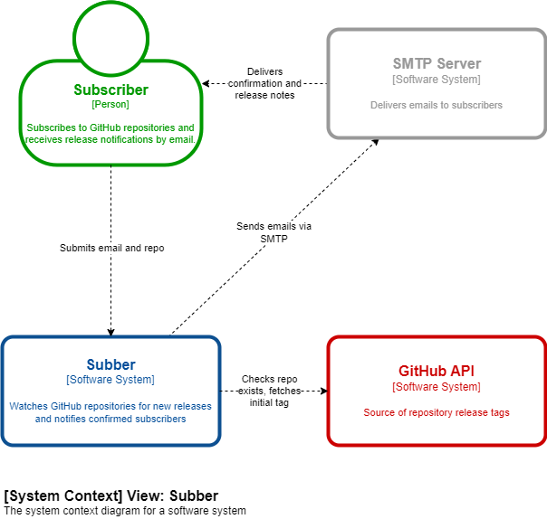

# Software Design Document (SDD)

## 1. Introduction
- **Purpose**: The purpose of this document is to define the design of the entire application system.
- **Scope**: This document covers the REST API design, 
  authentication via API KEY, background worker architecture, 
  and the web interface that consumes the API.

---

## 2. System Overview
- **System Description**: A REST API protected by API KEY authentication, 
  consumed by a web interface. Handles requests and runs background 
  tasks via goroutines.
- **Design Goals**: Scalability, maintainability.
- **Architecture Summary**: Single monolith application with concurrent 
  background workers implemented as goroutines. No microservices.
- **System Context Diagram**:
  

---

## 3. Architectural Design
- **System Architecture Diagram**:
  - *Use Mermaid diagram here.*
- **Component Breakdown**:
  - - [Component 1]: [Responsibilities, interactions.]
  - - [Component 2]: [Responsibilities, interactions.]
- **Technology Stack**: [Languages, frameworks, databases.]
- **Data Flow and Control Flow**:
  - *Use Mermaid sequence or flow diagrams here.*

---

## 4. Detailed Design
For each module/component:

### [Component Name]
- **Responsibilities**: [What does it do?]
- **Interfaces/APIs**:
  - Inputs: [Describe input data.]
  - Outputs: [Describe output data.]
  - Error Handling: [Describe approach.]
- **Data Structures**: [Key models/schemas.]
- **Algorithms/Logic**: [Design patterns or important logic.]
- **State Management**: [How is state handled?]

---

## 5. Database Design
- **ER Diagram / Schema Diagram**:
  - *Use Mermaid ER diagram here.*
- **Tables/Collections**: [Define each with fields and constraints.]
- **Relationships**: [Describe relationships between entities.]
- **Migration Strategy**: [If applicable.]

---

## 6. External Interfaces
- **User Interface**: [Mockups, UX notes.]
- **External APIs**: [Integrations and dependencies.]
- **Hardware Interfaces**: [If any.]
- **Network Protocols/Communication**:
  - [REST, GraphQL, gRPC, WebSockets, etc.]

---

## 7. Security Considerations
- **Authentication**: [Method used.]
- **Authorization**: [Role/permission models.]
- **Data Protection**: [Encryption, storage.]
- **Compliance**: [GDPR, HIPAA, etc.]
- **Threat Model**:
  - *Use Mermaid diagram here if helpful.*

---

## 8. Performance and Scalability
- **Expected Load**: [Requests per second, data volume.]
- **Caching Strategy**: [Describe caches used.]
- **Database Optimization**: [Indexes, partitioning.]
- **Scaling Strategy**: [Vertical/horizontal.]

---

## 9. Deployment Architecture
- **Environments**: Only one.
- **CI/CD Pipeline**: CI: test/build/linter.
- **Infrastructure Diagram**:
  - *Use Mermaid diagram here.*
- **Cloud/Hosting**: localhost
- **Containerization/Orchestration**: Docker conteinerization.

---

## 10. Testing Strategy
- **Unit Testing**: [Tools, coverage goals.]
- **Integration Testing**: [Approach and tools.]
- **End-to-End Testing**: [Scope and tools.]
- **Quality Metrics**: [Code coverage, linting, etc.]

---

## 11. Appendices
- **Diagrams**: [All referenced diagrams.]
- **Glossary**: [Terms and definitions.]
- **Change History**:
  - [Version, Date, Author, Changes]

---

> **Tip**: Use Mermaid diagrams throughout to make architecture, data flow, and interfaces clear and easy to maintain.
